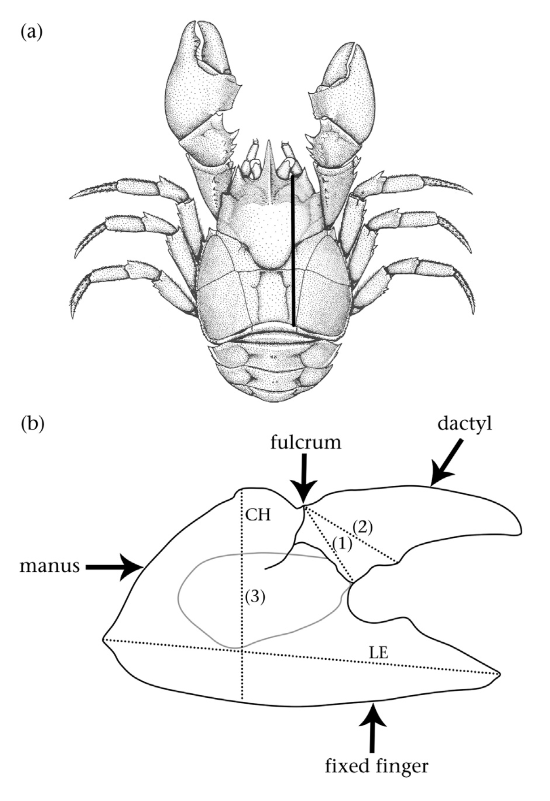

```{r setup, include=FALSE}
knitr::opts_chunk$set(echo = TRUE)
knitr::knit_hooks$set(inline = function(x) {
prettyNum(x, big.mark=",")
})
```

Para entender o contexto deste tutorial e creditar seus autores, leia o
[README](https://github.com/marmello77/EcoAnimal/blob/main/README.md).

## Instruções gerais

1.  Mude o modo de vizualização aqui no RStudio para `Visual`, clicando
    no botão que fica no canto esquerdo da barra de formatação;

2.  Clique no triângulo verde da primeira caixinha de código (dentro
    dela, no alto à direita), logo acima desta seção;

3.  Leia atentamente este roteiro e faça a prática junto com o seu
    grupo;

4.  Tente fazer a prática sem a ajuda dos docentes. Caso não consiga,
    peça-nos ajuda;

5.  No relatório a ser entregue, adicione um cabeçalho com os nomes
    completos dos integrantes do grupo, incluindo seus números USP e a
    data da prática;

6.  O relatório deve ser entregue através da tarefa criada no moodle da
    disciplina, no formato pedido;

7.  Não serão aceitos relatórios entregues fora do prazo determinado.

## Artigo de base

[Palaoro et al. (2014 Animal
Behaviour)](http://dx.doi.org/10.1016/j.anbehav.2014.06.014)

## Agradecimentos

[Alexandre Palaoro](https://github.com/alexandrepalaoro), primeiro autor
do artigo de referência, gentilmente nos cedeu os dados usados nesta
prática.

## **Objetivo**

Um dos fenômenos mais importantes relacionados à reprodução animal é a
seleção sexual. Nesta prática, treinaremos como testar hipóteses
concorrentes à luz das evidências disponíveis, usando a abordagem
conhecida como inferência forte.

## Contexto

Nosso objeto de estudo são interações agonísticas entre machos de uma
mesma espécie. Essas interações visam resolver disputas por recursos,
sejam fêmeas, território ou alimento. A disputa pode envolver confronto
indireto, quando os machos avaliam as características um do outro e um
deles desiste antes mesmo de lutar. Ou pode envolver confronto direto,
quando os machos chegam às vias de fato, entrando em luta corporal.
Essas lutas não costumam levar a danos sérios ou à morte, pois é comum
um dos machos desistir depois de avaliar suas chances de vencer e o que
ele tem a perder. Para entender os mecanismos que determinam os
resultados dessas lutas, usaremos como modelo de estudo caranguejos da
espécie *Aegla longirostri*. Os dados foram analisados em um artigo
científico (Palaoro et al. 2014, Animal Behaviour), cujo primeiro autor
gentilmente nos cedeu a planilha.

## Passos iniciais

1.  Assista ao [vídeo da
    luta](https://edisciplinas.usp.br/mod/hvp/view.php?id=5081849) entre
    caranguejos disponível no moodle. Eles pertencem ao mesmo gênero
    daqueles usados como modelo de estudo no artigo de base;

2.  Veja a figura 1 abaixo, que apresenta informações importantes sobre
    a morfologia dos caranguejos estudados no artigo de base;

3.  Examine os dados e metadados da planilha XLSX fornecida;

4.  Qual dessas medidas fornecidas na planilha você acha que deve ser
    mais importante para prever quem ganhará uma luta entre dois
    caranguejos machos dessa espécie? Elabore um mapa mental contendo
    problema, pergunta, hipóteses, premissas e previsões sobre isso,
    usando as técnicas aprendidas nas aulas anteriores;

5.  Elabore um ou mais gráficos que representem testes visuais dessas
    previsões, seguindo as instruções da próxima seção;

6.  Complete o seu mapa mental, indicando se as previsões se confirmaram
    ou não, apenas com base nos gráficos que plotou;

7.  Inclua uma conclusão geral sucinta no seu mapa.

8.  Salve o relatório em formato PDF e carregue-o no link de entrega no
    moodle.

### Figura 1

{width="564"}

Legenda: (a) Representação de um macho da espécie de caranguejo Aegla
longirostri adaptado de (Bond-Buckup 2003, apud Palaoro et al. 2014). A
linha preta representa o comprimento do cefalotórax. (b) Representação
esquemática da garra esquerda. LE: comprimento da garra; CH: altura da
garra; (1): altura do dedo; (2): distância do fulcro ao primeiro
tubérculo; (3): apodema.

## Plotando alguns exemplos de gráficos

### Sumário

[Preparativos](#preparativos)

[Teste 1](#teste1)

[Teste 2](#teste2)

[Teste 3](#teste3)

[Teste 4](#teste4)

[Teste 5](#teste5)

[Para saber mais](#mais)

### Preparativos {#preparativos}

Diga ao `RStudio` que o diretório de trabalho é o mesmo onde está este
arquivo de tutorial. Para executar as linhas de código desta e das
demais caixinhas do tutorial, clique no triângulo verde da caixinha de
código desejada, no alto à direita

```{r}
setwd(dirname(rstudioapi::getActiveDocumentContext()$path))
```

Limpe os objetos criados anteriormente e também o console:

```{r}
rm(list= ls())

cat("\014")  
```

Carregue os pacotes necessários:

```{r}
library(ggplot2)
library(lme4)
```

Importe os dados e inspecione-os.

```{r}
dados<- read.delim("dados.txt", header=T)
dim(dados)
head(dados)
tail(dados)
```

Transforme a variável "status" em numérica e binária, salvando-a como
uma nova variável.

```{r}
dados$status2 <- ifelse(dados$status == "perdedor", 0, 1)
head(dados)
```

Examine de forma rápida as relações entre as variáveis.

```{r}
plot(dados$cc~dados$ap)
plot(dados$status2~dados$cc)
plot(dados$status2~dados$ap)
```

### Teste 1: 1 fator vs 1 resposta {#teste1}

Plote a relação entre o status e o comprimento cefalotorácico, depois
exporte o gráfico como um arquivo PNG.

```{r}

png(filename= "figuras/p1.png", res= 300, height= 2000, width= 3000)
p1 = ggplot(dados, aes(x=cc, y=status2)) + 
  geom_point(colour = "#1855FA", size=4, alpha = 0.5) + 
  stat_smooth(method="glm", method.args=list(family="binomial"), se=FALSE) +
  labs(x="Comprimento cefalotorácico", y = "Status") +
  theme(text = element_text(size=20),
        plot.title = element_text(size=40, hjust=0.5),
        axis.text.x = element_text(size = 20, angle=0, hjust=1),
        axis.text.y = element_text(size = 20, angle=0, vjust=1),
        axis.title.x = element_text(size = 30, angle=0),
        axis.title.y = element_text(size = 30, angle=90))
p1
dev.off()
```

Teste se a relação é significativa e examine os valores estatísticos,
depois exporte os resultados como um arquivo TXT.

```{r}
fit1 = glm(dados$status2~dados$cc, family=binomial)
summary(fit1)
res1 = anova(fit1, test="Chisq")
res1
capture.output(res1, file = "resultados/resultados-cc.txt")

```

Você tambem pode plotar o gráfico usando apenas o pacote base, com base
nos resultados do teste que acabou de fazer.

```{r}
plot(dados$status2~dados$cc,
     xlab = "Comprimento do corpo",
     ylab = "Status")
curve (exp(fit1$coefficients[[1]]+fit1$coefficients[[2]]*x)/
         (1+exp(fit1$coefficients[[1]]+fit1$coefficients[[2]]*x)),
       add=T)
```

### Teste 2 {#teste2}

Plote a relação entre o status e a altura do própodo, depois exporte o
gráfico como um arquivo PNG.

```{r}
png(filename= "figuras/p2.png", res= 300, height= 2000, width= 3000)
p2 = ggplot(dados, aes(x=ap, y=status2)) + 
  geom_point(colour = "#1855FA", size=4, alpha = 0.5) + 
  stat_smooth(method="glm", method.args=list(family="binomial"), se=FALSE) +
  labs(x="Altura da garra", y = "Status") +
  theme(text = element_text(size=20),
        plot.title = element_text(size=40, hjust=0.5),
        axis.text.x = element_text(size = 20, angle=0, hjust=1),
        axis.text.y = element_text(size = 20, angle=0, vjust=1),
        axis.title.x = element_text(size = 30, angle=0),
        axis.title.y = element_text(size = 30, angle=90))
p2
dev.off()
```

Teste se a relação é significativa e examine os valores estatísticos,
depois exporte os resultados como um arquivo TXT.

```{r}
fit2 = glm(dados$status2~dados$ap, family=binomial)
summary(fit2)
res2 = anova(fit2, test="Chisq")
res2
capture.output(res2, file = "resultados/resultados-ap.txt")

```

Você tambem pode plotar o gráfico usando apenas o pacote base, com base
nos resultados do teste que acabou de fazer.

```{r}
plot(dados$status2~dados$ap,
     xlab = "Comprimento do corpo",
     ylab = "Status")
curve (exp(fit2$coefficients[[1]]+fit2$coefficients[[2]]*x)/
         (1+exp(fit2$coefficients[[1]]+fit2$coefficients[[2]]*x)),
       add=T)
```

### Teste 3 {#teste3}

Teste como tanto o comprimento cefalotorácico quanto a altura do própodo
determinam o status, depois exporte os resultados como um arquivo TXT.

```{r}
fit3 = glm(dados$status2~dados$ap+dados$cc, family=binomial)
summary(fit3)
res3 = anova(fit3, test="Chisq")
res3
capture.output(res3, file = "resultados/resultados-ap-cc.txt")
```

### Teste 4 {#teste4}

Teste como tanto o comprimento cefalotorácico quanto a altura do própodo
determinam o status, mas considerando a identidade da dupla como um
fator aleatório, depois exporte os resultados como um arquivo TXT.

```{r}
fit4 = glmer(status2 ~ ap + cc + (1|dupla), family=binomial, data=dados)
summary(fit4)
res4 = anova(fit4, test="Chisq")
res4
capture.output(res4, file = "resultados/resultados-ap-cc-dupla.txt")
isSingular(fit4, tol = 1e-05)
```

### Teste 5 {#teste5}

Teste a relação entre os fatores usados nas análises anteriores,
salvando os resíduos dessa relação para fazer uma nova análise.

```{r}
fit5 = lm(cc ~ ap, data=dados) 
summary(fit5)
fit5.res = resid(fit5)
```

Plote a relação entre os fatores, depois exporte o gráfico como um
arquivo PNG.

```{r}
png(filename= "figuras/p5.png", res= 300, height= 3000, width= 3000)
p5 = ggplot(dados, aes(x=cc, y=ap), CI = F) +
  geom_smooth(method=lm, colour = "#1855FA") +
  geom_point(colour = "#1855FA", size=4, alpha = 0.5) +
  geom_ribbon(stat='smooth', method = "lm", se=TRUE, alpha=0.1, 
              fill = "#1855FA") +
  ggtitle("") +
  labs(x="Comprimento do corpo", y = "Altura da garra") +
  theme(text = element_text(size=20),
        plot.title = element_text(size=40, hjust=0.5),
        axis.text.x = element_text(size = 20, angle=0, hjust=1),
        axis.text.y = element_text(size = 20, angle=0, vjust=1),
        axis.title.x = element_text(size = 30, angle=0),
        axis.title.y = element_text(size = 30, angle=90))
p5
dev.off()
```

Plote a relaçãoo entre status e os resíduos da relacao entre comprimento
cefalotorácico e altura do própodo, depois exporte o gráfico como um
arquivo PNG.

```{r}
p6 = png(filename= "figuras/p6.png", res= 300, height= 2000, width= 3000)
ggplot(dados, aes(x=fit5.res, y=status2)) + 
  geom_point(colour = "#1855FA", size=4, alpha = 0.5) + 
  stat_smooth(method="glm", method.args=list(family="binomial"), se=FALSE) +
  labs(x="Residuos corpo-garra", y = "Status") +
  theme(text = element_text(size=20),
        plot.title = element_text(size=40, hjust=0.5),
        axis.text.x = element_text(size = 20, angle=0, hjust=1),
        axis.text.y = element_text(size = 20, angle=0, vjust=1),
        axis.title.x = element_text(size = 30, angle=0),
        axis.title.y = element_text(size = 30, angle=90))
p6
dev.off()
```

Teste se a relação é significativa e examine os valores estatísticos,
depois exporte os resultados como um arquivo TXT.

```{r}
fit6 = glmer(status2 ~ fit5.res + (1|dupla), family=binomial, data=dados)
summary(fit6)
res6 = anova(fit6, test="Chisq")
res6
capture.output(res6, file = "resultados/resultados-res-dupla.txt")
isSingular(fit6, tol = 1e-05)
```

## Para saber mais {#mais}

Bolker, B. M., Brooks, M. E., Clark, C. J., Geange, S. W., Poulsen, J.
R., Stevens, M. H. H., & White, J.-S. S. (2009). Generalized linear
mixed models: a practical guide for ecology and evolution. Trends in
Ecology & Evolution, 24(3), 127--135.
<https://doi.org/10.1016/j.tree.2008.10.008>

Dobson, A. J., & Barnett, A. J. (2008). An introduction to generalized
linear models (3rd ed.). CRC Press.

Ellison, A. M., Gotelli, N. J., Inouye, B. D., & Strong, D. R. (2014). P
values, hypothesis testing, and model selection: it's déjà vu all over
again. Ecology, 95(3), 609--610. <https://doi.org/10.1890/13-1911.1>

Zuur, A. F., Ieno, E. N., Walker, N., Saveliev, A. A., & Smith, G. M.
(2009). Mixed effects models and extensions in ecology with R (1st ed.).
Springer New York. <https://doi.org/10.1007/978-0-387-87458-6>

Zuur, A. F., Ieno, E. N., & Elphick, C. S. (2010). A protocol for data
exploration to avoid common statistical problems. Methods in Ecology and
Evolution, 1(1), 3--14.
<https://doi.org/10.1111/j.2041-210X.2009.00001.x>

Tidy Data Manifesto: <https://vita.had.co.nz/papers/tidy-data.html>

Regressão logística na Wikipedia:
<https://en.wikipedia.org/wiki/Logistic_regression>

GLM na Wikipedia:
<https://en.wikipedia.org/wiki/Generalized_linear_model>
